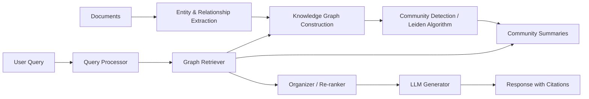

## Summary

GraphRAG is Microsoft Research's next-generation retrieval-augmented generation architecture that replaces flat text chunks with a **knowledge graph** of entities and relationships. By applying community detection algorithms to cluster related concepts and generating hierarchical summaries, GraphRAG enables multi-hop reasoning, corpus-wide synthesis, and explainable answers — capabilities that traditional vector-similarity RAG struggles to deliver.

> "GraphRAG organizes information into an interconnected graph of entities and relationships, enabling multi-hop reasoning, corpus-wide summarization, and explainable answers."

The open-source Python library supports both local (entity-centric) and global (community-centric) search, runs on-premises or with Azure OpenAI, and targets enterprise knowledge management, scientific discovery, healthcare, and legal analysis.

## Improve Capture & Transcript (ICT)

### What Is GraphRAG?

GraphRAG builds on RAG's core idea of supplementing LLM outputs with retrieved external knowledge, but replaces flat document chunks with a **knowledge graph** that explicitly models entities, their relationships, and contexts. This empowers the AI to reason across connections rather than just matching semantically similar text passages. Microsoft introduced this approach in 2024 to address LLM shortcomings in reasoning and working with structured data.

### Knowledge Graphs

A knowledge graph structures data as nodes (entities like people, concepts, organizations), edges (relationships), and attributes. For example: "Albert Einstein — developed — theory of relativity" forms nodes connected by a directed edge. This explicit structure allows machines to traverse relationships rather than relying on proximity in vector space.

### Community Summaries and Hierarchical Summarization

GraphRAG applies **community detection algorithms** (e.g., Leiden, Louvain) to cluster related nodes and edges in the graph, creating "communities." Summaries are generated for each community at multiple hierarchical levels. These summaries allow efficient synthesis of broad topics and patterns across the entire dataset, not just retrieval of isolated facts.

### Graph-Based Reasoning

Graph traversal enables **multi-hop reasoning**: connecting indirect links (A→B→C) rather than just matching text. The structure supports complex queries like "What drugs treat disease X and target gene Y?" by following relationship edges for both treatments and targets. This is a fundamental advantage over single-hop retrieval in traditional RAG systems.

### Architecture



The pipeline consists of several key components:

| Component | Purpose |
|-----------|---------|
| **Query Processor** | Parses user query, extracts relevant entities and relationships, maps to graph elements |
| **Retriever** | Traverses the graph to pull relevant subgraphs using entity linking or hybrid graph-vector search |
| **Organizer** | Prunes irrelevant nodes, re-ranks results, prepares community summaries for the generator |
| **Generator** | LLM synthesizes the final response grounded in explicit graph relationships |
| **Data Source** | The underlying knowledge graph, built from documents, datasets, or domain content |

### How GraphRAG Works — Step by Step

1. **Data Ingestion & Chunking** — Raw documents are sliced into smaller text units, each indexed with unique IDs.
2. **Entity & Relationship Extraction** — LLMs scan each chunk to identify entities (people, projects, concepts) and relationships between them.
3. **Knowledge Graph Construction** — Extracted entities become graph nodes, relationships form edges, enriched with claims and semantic tags.
4. **Community Detection** — Algorithms like Leiden automatically detect clusters of densely connected entities; summaries are generated per cluster.
5. **Query Handling** — Parse user query → retrieve relevant nodes, edges, and communities → if broad, use community summaries; if specific, traverse the local neighborhood.
6. **Response Generation** — Pass retrieved graph context and summaries to the LLM, which answers with depth, supporting evidence, and explainability.

### GraphRAG vs Traditional RAG

| Feature | Traditional RAG | GraphRAG |
|---------|----------------|----------|
| Knowledge Structure | Flat document/text chunks in vectors | Interconnected graph of entities and relations |
| Retrieval Method | Semantic/lexical similarity search | Graph traversal, entity linkage, community search |
| Context Handling | Isolated text chunks | Rich, context-aware subgraphs and community summaries |
| Reasoning | Limited, usually single-hop | Multi-hop, relational, and structural |
| Explainability | Limited | High — shows which entities and relationships led to the answer |
| Best For | General knowledge search | Multi-relational reasoning, enterprise, science, healthcare, law |

### Use Cases

- **Enterprise Knowledge Management** — Connects insights across emails, wikis, reports, and policies for complex organizational queries.
- **Scientific Literature Discovery** — Synthesizes connections across research papers (e.g., gene-disease relationships).
- **Medical Records Analysis** — Tracks medication-outcome relationships across patient records.
- **Legal Case Analysis** — Maps relationships between contracts, clauses, case histories, and parties.
- **Customer Support** — Connects trouble tickets, solutions, and engineering change records across silos.
- **Auditing & Provenance** — Traces source evidence for generated outputs.

### Microsoft Implementation

Microsoft provides GraphRAG as an open-source Python library:

```bash
pip install graphrag==1.2.0

# Index a corpus
graphrag index --root ./input/documents

# Query the graph
graphrag query --question "What is the relationship between Alice and Bob?"
```

- **GitHub**: [microsoft/graphrag](https://github.com/microsoft/graphrag)
- **Docs**: [microsoft.github.io/graphrag](https://microsoft.github.io/graphrag/)
- Supports both **local search** (entity-centric) and **global search** (community-centric)
- Runs on-premises or with Azure OpenAI
- Modular pipeline: extraction → partitioning → summarization → querying

### References

- [Microsoft GraphRAG Official Docs](https://microsoft.github.io/graphrag/)
- [Microsoft Research — Project GraphRAG](https://www.microsoft.com/en-us/research/project/graphrag/)
- [GitHub — microsoft/graphrag](https://github.com/microsoft/graphrag)
- [IBM — What is GraphRAG?](https://www.ibm.com/think/topics/graphrag)
- [DataCamp — GraphRAG Tutorial](https://www.datacamp.com/tutorial/graphrag)
- [AWS — Improving RAG Accuracy with GraphRAG](https://aws.amazon.com/blogs/machine-learning/improving-retrieval-augmented-generation-accuracy-with-graphrag/)
- [How Microsoft GraphRAG Works Step-By-Step](https://tech.bertelsmann.com/en/blog/articles/how-microsoft-graphrag-works-step-by-step-part-12)
- [LearnOpenCV — GraphRAG Practical Guide](https://learnopencv.com/graphrag-explained-knowledge-graphs-medical/)
