# DuckyAI — System Design Document

> **Generated:** 2026-03-11 | **Updated:** 2026-03-13  
> **Version:** 1.0.0  
> **Type:** Architecture / System Design

---

## 1. Overview

**DuckyAI** is an AI-powered personal knowledge management (DuckAI) platform that combines an **Obsidian vault**, a **Python orchestrator daemon**, a **Python MCP server**, and **GitHub Copilot / Claude Code integration** into a unified automation system.

The core idea: give AI assistants **persistent memory** of your work by storing everything in markdown files, then automate repetitive knowledge management tasks through event-driven agents.

### Key Capabilities

| Capability | How |
|---|---|
| **Automated document ingestion** | File watcher detects new files → AI enriches and organizes them |
| **Scheduled summaries** | Cron-triggered agents generate daily roundups, topic indexes |
| **Teams integration** | Hourly sync of chats & meetings into vault notes (configurable lookback) |
| **Interactive DuckAI** | Copilot prompts for creating tasks, meetings, investigations |
| **Multi-executor AI** | Supports Claude Code, Copilot SDK, Gemini CLI as agent backends |

---

## 2. High-Level Architecture

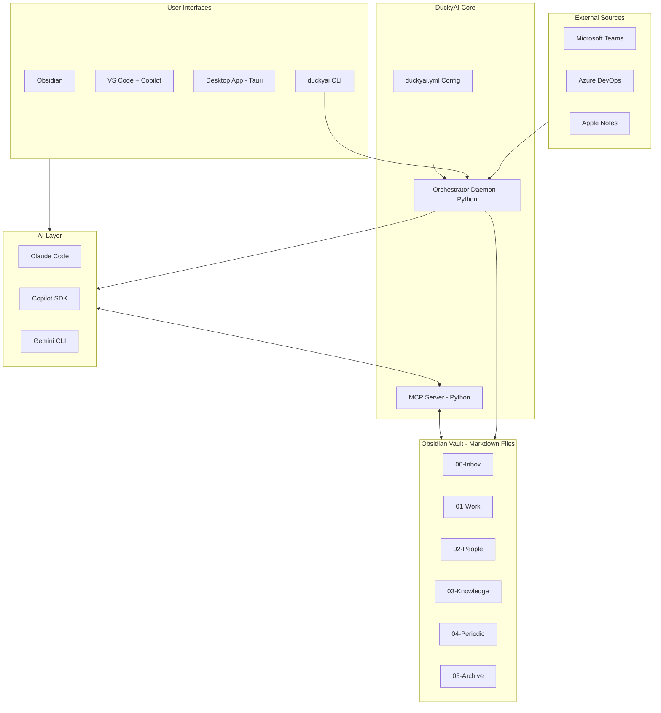

---

## 3. Component Architecture

### 3.1 Orchestrator Daemon (Python)

The heart of automation. A long-running daemon that reacts to file system events and cron schedules to trigger AI agents.

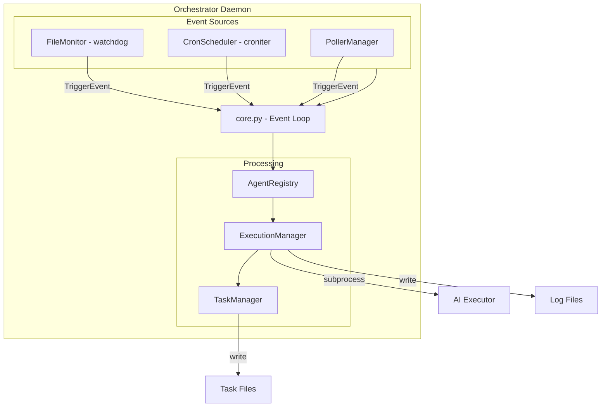

#### Component Responsibilities

| Component | File | Purpose |
|---|---|---|
| **Core** | `core.py` | Main event loop; coordinates all subsystems |
| **FileMonitor** | `file_monitor.py` | Watches vault via `watchdog`; debounces events (500ms) |
| **CronScheduler** | `cron_scheduler.py` | Evaluates cron expressions every 60s; 10-min cooldown |
| **PollerManager** | `poller_manager.py` | Polls external sources (Apple Notes, Teams) |
| **AgentRegistry** | `agent_registry.py` | Loads agent definitions from `duckyai.yml` nodes |
| **ExecutionManager** | `execution_manager.py` | Manages concurrency limits; invokes AI executors |
| **TaskManager** | `task_manager.py` | Creates/updates task tracking files for audit |

#### Orchestrator Event Flow

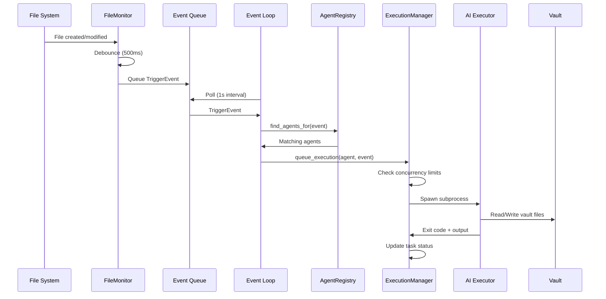

### 3.2 MCP Server (Python)

Exposes vault operations as standardized tools to AI assistants via the Model Context Protocol. Runs as a **separate process** spawned by the AI host (Copilot, Claude) over stdio transport. Wraps the same `VaultService` class used by the daemon's Flask API.

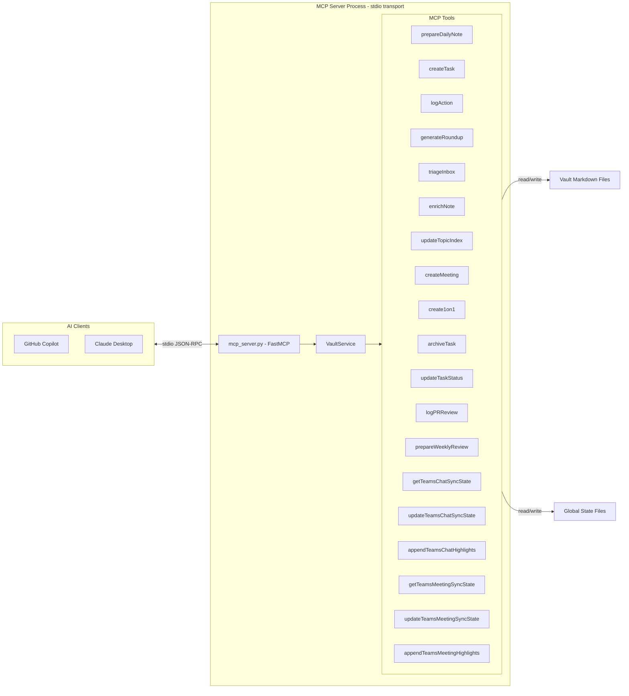

**Entry point:** `duckyai-vault-mcp = "duckyai.mcp_server:main"` (in pyproject.toml)

#### Key MCP Tool Categories

| Category | Tools | Description |
|---|---|---|
| **Daily Notes** | `prepareDailyNote`, `logAction`, `logPRReview` | Create and append to daily notes |
| **Task Management** | `createTask`, `updateTaskStatus`, `archiveTask` | Full task lifecycle |
| **Meetings** | `createMeeting`, `create1on1` | Meeting note creation |
| **Aggregation** | `generateRoundup`, `prepareWeeklyReview`, `updateTopicIndex` | Summarize and index |
| **Organization** | `triageInbox`, `enrichNote` | Process and structure content |
| **Teams Sync** | `get/updateTeamsChatSyncState`, `appendTeamsChat/MeetingHighlights` | Watermark-based Teams integration |

### 3.3 CLI (`duckyai`)

Python Click-based CLI providing orchestrator control and vault operations.

```
duckyai
├── init                              # Initialize vault
├── setup                             # First-time OOBE
├── show-config                       # Display duckyai.yml
├── template list|new                 # Template operations
├── trigger [AGENT_ABBR]              # Manually trigger agent
├── update                            # Update vault from template
├── voice                             # Voice input mode
├── orchestrator
│   ├── start                         # Start daemon (PID file)
│   ├── stop                          # Stop daemon
│   ├── status                        # Check status
│   ├── list-agents                   # Show loaded agents
│   └── trigger [ABBR]               # Trigger single agent
│       └── --lookback N              # Override lookback hours (TCS/TMS)
├── -o / --orchestrator               # Run daemon mode
│   └── (prompts: Sync Teams? → Lookback hours?)
└── (auto-start: Sync Teams? → Lookback hours?)
```

### 3.4 Vault Structure

The Obsidian vault is the central data store — all content is markdown with YAML frontmatter.

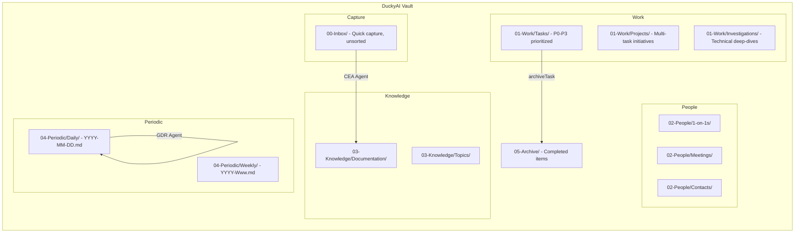

---

## 4. Agent System

### 4.1 Configured Agents (4)

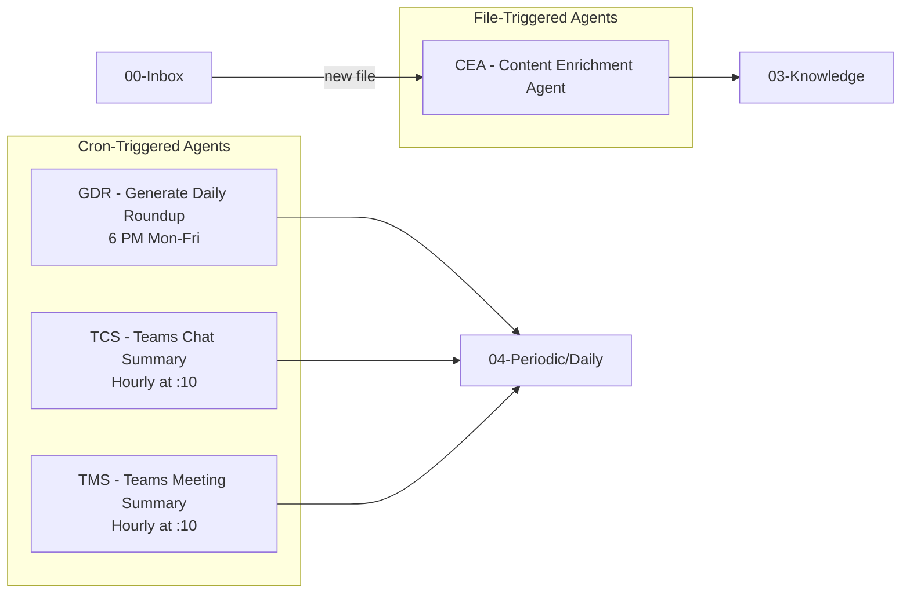

| Agent | Abbr | Trigger | Input | Output | Executor |
|---|---|---|---|---|---|
| Content Enrichment Agent | CEA | File created in `00-Inbox/` | `00-Inbox/*.md` | `03-Knowledge/Documentation/` | copilot_sdk |
| Generate Daily Roundup | GDR | Cron: `0 18 * * 1-5` | Scans vault | `04-Periodic/Daily/` | copilot_sdk |
| Teams Chat Summary | TCS | Cron: `10 * * * *` | WorkIQ (Microsoft Graph) | Daily note update | copilot_sdk |
| Teams Meeting Summary | TMS | Cron: `10 * * * *` | WorkIQ (Microsoft Graph) | Daily note + meeting files | copilot_sdk |

> **Note:** TCS and TMS support a configurable `lookback_hours` agent parameter (defaults: TCS=1h, TMS=24h). On first run or manual trigger, users are prompted for lookback hours via `--lookback N` or interactive input.

### 4.2 Agent Execution Model

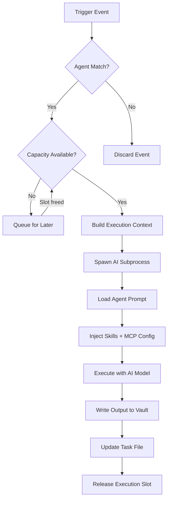

**Concurrency Controls:**
- **Global limit:** `max_concurrent: 3` (across all agents)
- **Per-agent limit:** `max_parallel` per node definition
- **Cooldown:** 10 minutes between repeated cron triggers

---

## 5. Skills & Prompts System

### 5.1 GitHub Copilot Skills (21)

Skills are reusable knowledge modules defined as `SKILL.md` files in `.github/skills/`. Each skill has YAML frontmatter defining triggers and a markdown body containing instructions.

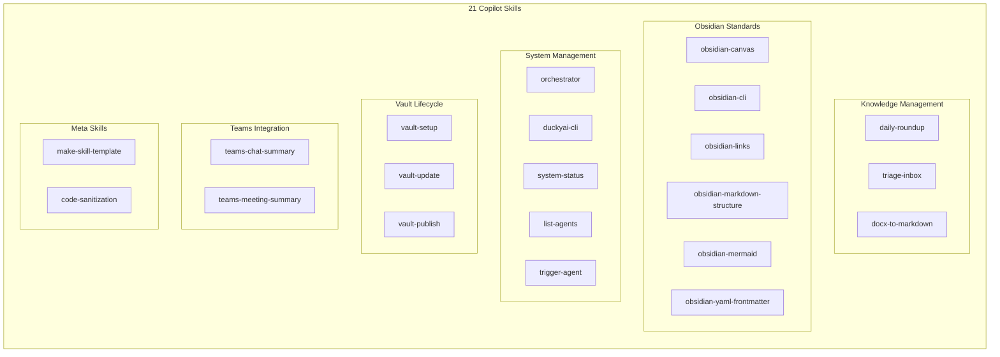

### 5.2 Copilot Prompts (7)

Interactive prompts triggered via `@workspace /command` in VS Code:

| Prompt | Command | Purpose |
|---|---|---|
| `new-task.prompt.md` | `/new-task` | Create prioritized task (P0–P3) |
| `new-meeting.prompt.md` | `/new-meeting` | Create meeting or 1:1 note |
| `new-investigation.prompt.md` | `/new-investigation` | Start technical deep-dive |
| `add-documentation.prompt.md` | `/add-documentation` | Add to knowledge base |
| `prioritize-work.prompt.md` | `/prioritize-work` | Get prioritized work view |
| `archive-task.prompt.md` | `/archive-task` | Complete and archive task |
| `restructure-document.prompt.md` | `/restructure-document` | Reformat content for vault |

---

## 6. Data Flow Diagrams

### 6.1 Document Ingestion Pipeline

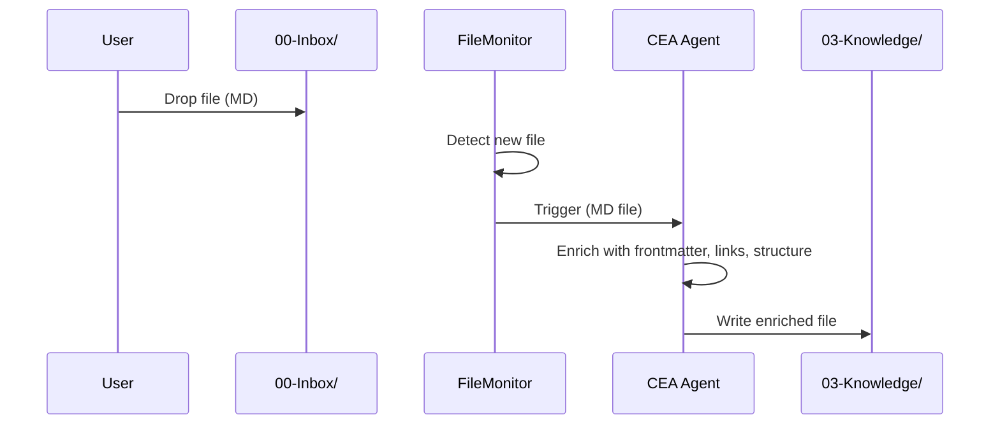

### 6.2 Daily Workflow Cycle

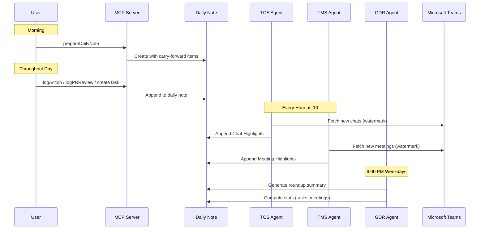

### 6.3 Task Lifecycle

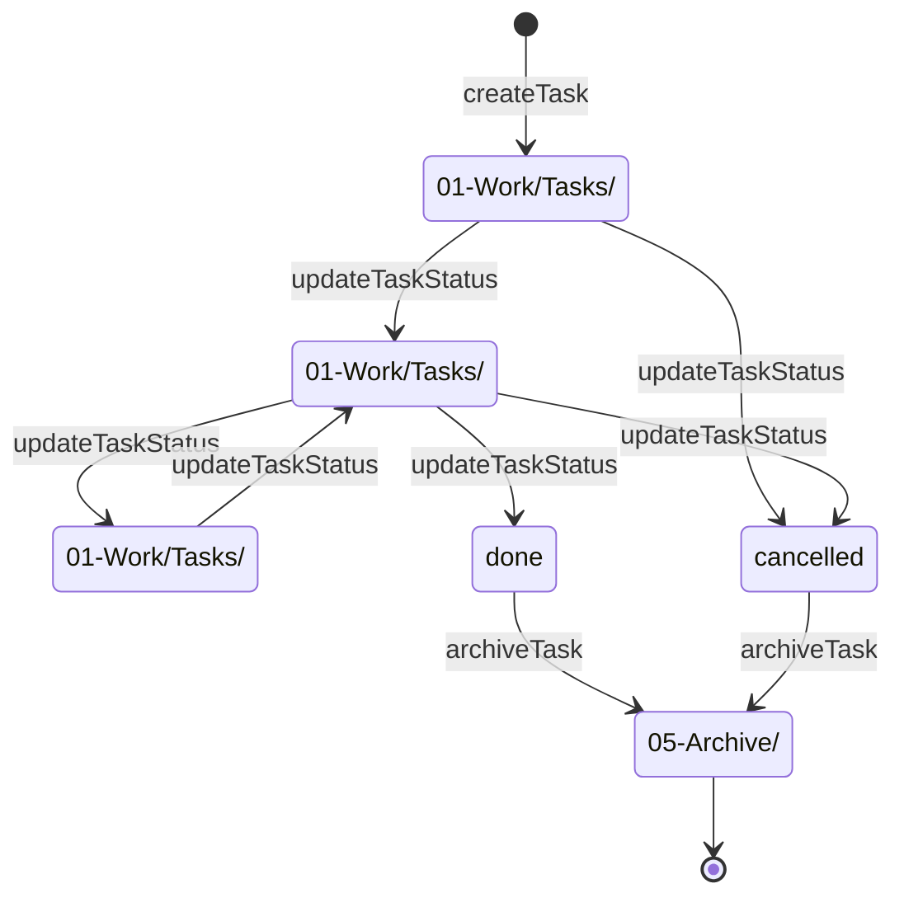

---

## 7. Configuration System

### 7.1 `duckyai.yml` Structure

```yaml
version: "1.0.0"
id: duckyai_vault
user:
  name: "User Name"
  primaryLanguage: ko
  timezone: "America/Los_Angeles"       # IANA timezone name (or abbreviation like PST)

orchestrator:
  auto_start: true
  prompts_dir: .github/prompts-agent    # Agent system prompts
  skills_dir: .github/skills            # Reusable AI skills
  bases_dir: .github/bases              # Base configuration
  max_concurrent: 3                     # Global execution limit
  poll_interval: 1                      # Event queue poll (seconds)
  file_extensions: [.md, .pdf, .docx, .doc, .txt]

defaults:
  executor: copilot_sdk                 # AI backend (copilot_sdk, claude_code, copilot_cli)
  timeout_minutes: 30
  max_parallel: 3
  task_create: true
  task_priority: medium
  agent_params:
    model: claude-sonnet-4.6

nodes:                                  # Agent definitions
  - name: "Agent Name (ABBR)"
    type: agent
    input_path: "00-Inbox"              # File trigger path
    output_path: "03-Knowledge/"        # Where output goes
    cron: "0 18 * * 1-5"               # Or cron schedule
    enabled: true
    executor: copilot_sdk               # Override default
    agent_params:                       # Per-agent overrides
      model: claude-haiku-4.5
      lookback_hours: 24                # Teams agents: configurable lookback
    workers: [...]                      # Multi-executor comparison

pollers:                                # External data sources
  apple_notes:
    enabled: false
    target_dir: 00-Inbox
    poll_interval: 3600
```

### 7.2 Configuration Hierarchy

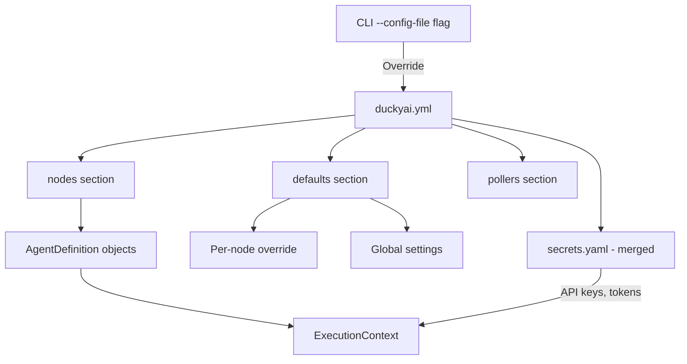

---

## 8. Runtime Architecture

### 8.1 File System Layout

```
~/.duckyai/                            # Global DuckyAI home
└── vaults/{vault_id}/                 # Per-vault runtime data
    ├── state/                         # Sync watermarks
    │   ├── tcs-last-sync.json         # Teams Chat sync state
    │   └── tms-last-sync.json         # Teams Meeting sync state
    ├── tasks/                         # Agent execution tracking
    │   └── YYYY-MM-DD ABBR - desc.md  # Task files (QUEUED/RUNNING/DONE/FAILED)
    ├── logs/                          # Execution logs
    │   └── YYYY-MM-DD-ABBR.log
    └── .orchestrator.pid              # Daemon PID file
```

### 8.2 Process Architecture

DuckyAI runs as **three independent processes** that share the same `VaultService` logic but serve different consumers:

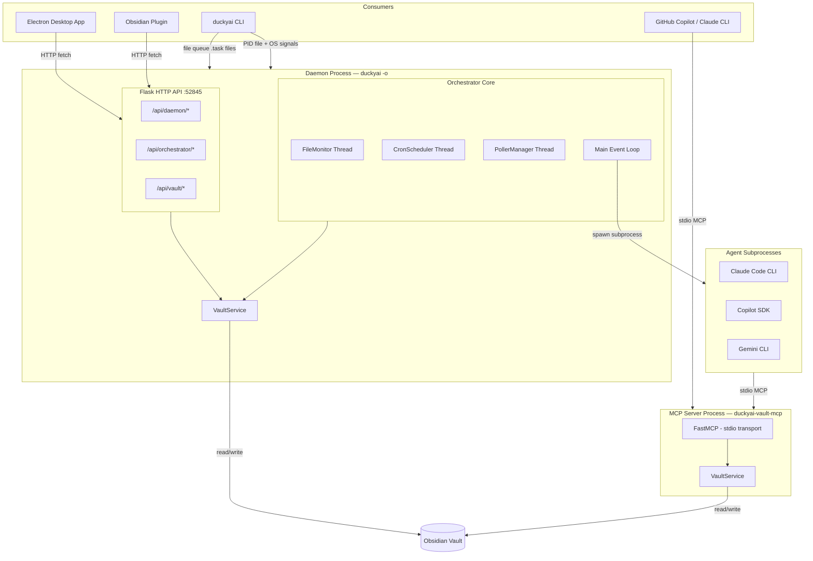

#### Three Processes, Three IPC Mechanisms

| Process | Started by | Purpose | IPC |
|---|---|---|---|
| **Daemon** (`duckyai -o`) | `duckyai orchestrator start` (detached) or `duckyai -o` (foreground) | File watching, cron scheduling, agent execution, HTTP API for UIs | — |
| **MCP Server** (`duckyai-vault-mcp`) | AI host (Copilot, Claude) as a child process | Expose vault tools to AI assistants via MCP protocol | stdio (JSON-RPC) |
| **Agent subprocesses** | Daemon's ExecutionManager | Run AI agents (Claude, Copilot, Gemini) | stdin/stdout + subprocess |

#### Why Three IPC Styles?

| IPC | Who uses it | Why |
|---|---|---|
| **HTTP (Flask :52845)** | Electron app, Obsidian plugin | Cross-language (Python↔JS) communication; `fetch` is native in both |
| **stdio MCP** | GitHub Copilot, Claude CLI | MCP protocol requirement — AI hosts expect stdio JSON-RPC |
| **File queue (.task files)** | `duckyai` CLI commands | Fire-and-forget; works even if daemon restarts before picking up |

#### VaultService — Shared Core, Two Interfaces

Both the daemon and the MCP server expose the same `VaultService` class — the pure-Python implementation of all vault operations (createTask, logAction, prepareDailyNote, etc.). The only difference is the transport layer:

```
AI Agents ──stdio JSON-RPC──► duckyai-vault-mcp ──► VaultService ──► Vault files
UIs ───────HTTP POST─────────► Flask /api/vault ──► VaultService ──► Vault files
```

These are independent processes with no shared memory. Concurrent writes are safe because each vault tool operates on separate files or uses append-only patterns.

#### Daemon Internal Threads

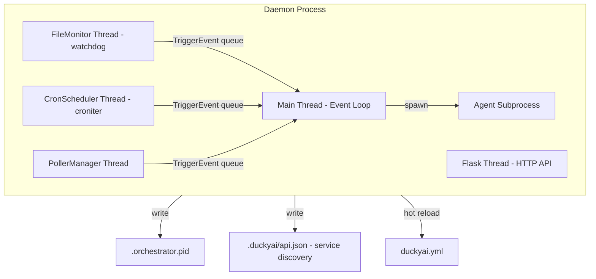

The daemon writes `.duckyai/api.json` (containing `host`, `port`, `pid`, `url`) so the Electron app and Obsidian plugin can discover the API endpoint at runtime.

---

## 9. Integration Points

### 9.1 Microsoft Teams

Teams integration uses a **watermark-based incremental sync** pattern. Each agent reads a `lastSynced` timestamp, fetches only new data since that point, and advances the watermark after processing.

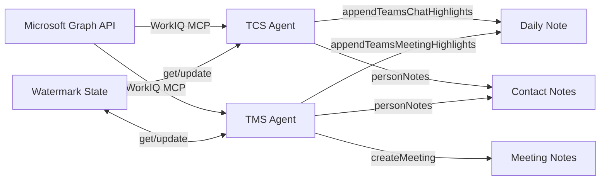

**Configurable lookback:** On first run (`lastSynced: null`) or manual trigger, agents use `lookback_hours` from `agent_params` (TCS default: 1h, TMS default: 24h). Users can override via `--lookback N` on the CLI or respond to the interactive prompt.

**⚠ Shared resource risk:** Watermark files (`tcs-last-sync.json`, `tms-last-sync.json`) are shared across all execution paths — daemon cron, inline trigger, and enqueued tasks. There is **no file locking**, so overlapping runs of the same agent can race on the watermark. See the resource map diagram at `cli/docs/agent-resource-map.svg`.

### 9.1.1 Timezone-Aware Date Handling

The MCP server resolves all user-facing dates using the timezone configured in `duckyai.yml` (`user.timezone`). This prevents daily notes from targeting "tomorrow" when the system clock is past midnight UTC but still the same local day.

- **IANA timezone names** are preferred (e.g., `America/Los_Angeles`)
- Common abbreviations (`PST`, `EST`, `KST`, `Pacific Standard Time`) are mapped to IANA names
- `Intl.DateTimeFormat` with `formatToParts()` is used for reliable locale-independent formatting
- Machine timestamps (e.g., `updatedAt` in sync state) remain UTC

### 9.2 VS Code / Copilot

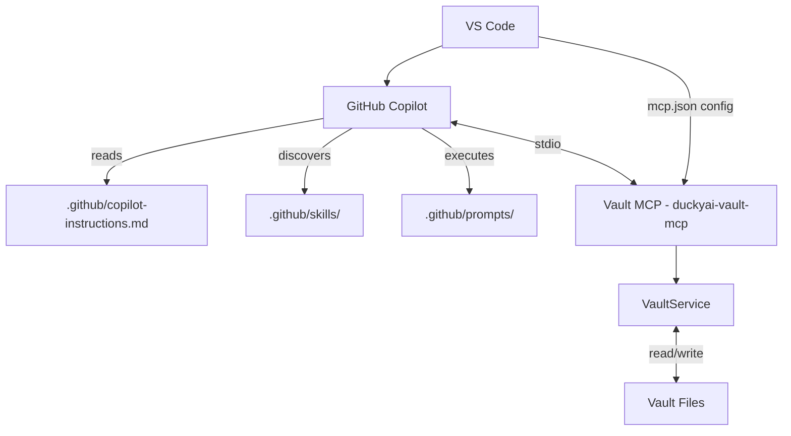

---

## 10. Technology Stack

| Layer | Technology | Purpose |
|---|---|---|
| **Orchestrator** | Python 3.9+, Click, watchdog, croniter | Daemon, CLI, file monitoring, scheduling |
| **Vault MCP** | Python, FastMCP, VaultService | Native vault tools for AI assistants |
| **AI Executors** | Claude Code SDK, Copilot SDK, Gemini CLI | Agent execution backends |
| **Desktop App** | Tauri 2.x (Rust + TypeScript) | Native wrapper (in development) |
| **Vault** | Obsidian + Periodic Notes + Templater + Dataview | Note-taking and knowledge management |
| **Configuration** | YAML (duckyai.yml), JSON (version.json, mcp.json) | System configuration |
| **State** | JSON files in `~/.duckyai/` | Watermarks, PID, task tracking |

---

## 11. Design Principles

1. **Markdown-First:** All data is plain markdown with YAML frontmatter — portable, version-controllable, human-readable
2. **Event-Driven:** File changes and cron schedules drive all automation — no polling loops for vault content
3. **Decoupled Components:** Orchestrator, MCP server, and CLI work independently — failure in one doesn't break others
4. **Multi-Executor:** Supports swapping AI backends (Claude, Copilot, Gemini) per agent — enables comparison and resilience
5. **Persistent Context:** The vault itself is the AI's memory — every note, task, and meeting enriches future interactions
6. **Hot-Reloadable:** Config changes to `duckyai.yml` are detected and applied without daemon restart
7. **Auditable:** Every agent execution creates a task file with status, timing, and error information
8. **Template-Based Updates:** Vault infrastructure can be updated from a template repo without touching personal content

---

## 12. Directory Map (Complete)

```
DuckyAI/
├── .github/
│   ├── copilot-instructions.md        # AI system context
│   ├── prompts/                       # 7 interactive Copilot prompts
│   ├── prompts-agent/                 # Agent system prompts (orchestrator)
│   ├── skills/                        # 21 Copilot skills (SKILL.md each)
│   └── bases/                         # Base configurations
├── .obsidian/                         # Obsidian vault config
├── .repos/                            # Cloned documentation repos (context)
├── .vscode/                           # VS Code settings + mcp.json
├── 00-Inbox/                          # Quick capture
├── 01-Work/
│   ├── Tasks/                         # Active tasks (P0-P3)
│   ├── Projects/                      # Multi-task initiatives
│   ├── Investigations/                # Technical deep-dives
│   └── Plans/                         # Roadmaps
├── 02-People/
│   ├── 1-on-1s/                       # Recurring 1:1 notes
│   ├── Meetings/                      # Meeting notes
│   └── Contacts/                      # People profiles
├── 03-Knowledge/
│   ├── Documentation/                 # Enriched documents
│   └── Topics/                        # Auto-generated topic indexes
├── 04-Periodic/
│   ├── Daily/                         # Daily notes (YYYY-MM-DD.md)
│   └── Weekly/                        # Weekly reviews
├── 05-Archive/                        # Completed items
├── Templates/                         # 9 Obsidian templates
├── cli/
│   ├── duckyai/                   # Python CLI + Orchestrator
│   │   ├── main/                      # CLI commands (Click)
│   │   ├── mcp_server.py              # Python MCP wrapper over VaultService
│   │   ├── orchestrator/              # Daemon subsystem
│   │   ├── pollers/                   # External data pollers
│   │   └── voice/                     # Voice interaction
│   ├── mcp-server/release-dashboard/  # Separate Python MCP package for release dashboards
│   └── docs/                          # Design docs and diagrams
├── desktop/                           # Tauri desktop app
├── scripts/
│   └── sync-repos.ps1                 # Clone documentation repos
├── duckyai.yml                        # Master orchestrator config
├── version.json                       # Template version tracking
├── DuckyAI.code-workspace             # VS Code workspace
├── AGENTS.md                          # AI agent rules
├── GETTING_STARTED.md                 # Onboarding guide
└── README.md                          # Project overview
```
